# RunGuild：从对话到可核验交付的架构学习笔记

核查日期：2026-09-22。源码仓库：`/home/sid/runguild`。代码基线 HEAD：`a51ccc37004e12f49b21a77c5b3cc7f23267b2e1`（`fix: bind acceptance evidence and verify integration candidates`），核查时工作树干净。**源码复核与定向离线验证范围见 [12-SOURCE-RECHECK.md](/home/sid/Voren_agent/docs/interview-prep/12-SOURCE-RECHECK.md)**。本文的测试链接用于定位断言，是否实际执行、结果及环境限制以该复核记录为准；不代表全量测试、真实 Mission 或付费模型验证。新增实现边界以静态源码为依据，离线复现结果另在 12 中标明。

适用背景：Sid 2025 年毕业，有一年多 360 Java/C++ Linux 开发经历，当前目标为 Agent 应用开发；RunGuild 代码大量由 AI 辅助生成，正在系统学习。下面的口述稿描述项目机制，不替你宣称全部代码手写、全部设计独立完成或生产上线。与公司经历的关联，只有真实参与内容才能建立。

## 1. 先理解项目解决了什么问题

RunGuild 是一个个人项目中的多 Agent 软件任务执行与验收平台。输入是人类在协作室描述的开发需求，目标输出是满足计划验收条件、经过所需评审与代码集成、最终由人类确认的版本化交付物。本文主线采用“需要评审、要求 test_run 证据、确实修改代码”的 Task；其他任务的证据与评审要求由计划决定，不能套用主线中的全部步骤。核心问题是：开发任务会持续多轮，模型可能停机、重复调用、花光预算，多个改动各自通过测试却在组合后失败；如果只靠聊天记录与“我已完成”，无法判断真正完成了什么。

它把“模型决定下一步做什么”和“系统认定状态是否有效”分开。模型规划和使用工具；数据库事务、证据门禁、版本绑定决定能否领取任务、重试、评审、解锁后继或更新目标分支。可讲的业务价值是让一次软件任务有可追踪状态、可恢复执行和明确交付条件。**尚无依据说它比单 Agent 更高效、有生产用户或达到通用安全沙箱能力。**

可口述的 90 秒版本：

> RunGuild 把自然语言开发需求转成需要人批准的任务 DAG，再由具有固定角色的 Agent 执行。Agent 是持续身份，一次任务尝试是独立 Run；任务、租约、上下文、工具结果和证据都存入 PostgreSQL，Redis 负责唤醒。执行中使用任务 Worktree，模型工具调用经过有幂等和审批状态的 Gateway。完成不能只听模型说 done，必须检查计划要求的证据。以需评审且要求测试的代码修改为例，测试要对应干净稳定的 commit 和 tree，评审读取不可变交付版本与固定证据集合；通过后集成进程测试合并候选，再更新目标分支，最后人类批准确切交付版本。这个项目适合讲持久执行机制及其边界；控制消费、精确批准与发布的再次绑定、外部验收、宿主隔离和完整成本统计仍有不足。

证据：[README](/home/sid/runguild/README.md)、[运行时](/home/sid/runguild/packages/agent-runtime/src/runtime.ts:259)、[完成门禁](/home/sid/runguild/packages/database/src/completion-verifier.ts:22)。

## 2. 先建立对象关系，不把所有东西都叫 Agent

| 对象 | 解决的问题 | 核心持久数据与生命周期 |
|---|---|---|
| Workspace | 租户和身份边界 | `workspaces/users`；不是网页上每个“工作区”的同义词 |
| Project | 一个仓库及其协作范围 | 仓库路径、默认分支、团队、Conversation、Mission；网页称为工作区 |
| Conversation | 人和 Agent 交换消息 | 成员、顺序消息、引用、mention 投递状态；不是任务完成事实 |
| Mission | 一次业务目标 | 目标、约束、版本化计划、批准与最终交付状态 |
| Task | 可调度、有验收条件的工作单元 | 角色、依赖、attempt 上限、验收证据种类、评审要求 |
| Agent | 持续的身份和配置 | 角色、模型、Skill 分配、Inbox；不是永远运行的进程 |
| Run | 某 Agent 对某 Task 的一次尝试 | `agent_runs`；attempt、hop、状态、冻结上下文、对话轨迹 |
| Worker instance | 当前占有执行权的操作系统进程会话 | token、心跳、过期与停止记录；同一 Agent 的活跃进程受到约束 |
| Task Worktree | 一个 Task 的代码工作空间 | 路径、分支、base/head/integrated commit；可跨重试复用，并非每 Run 必建一个 |
| Artifact / Version | 协作文档及可审查版本 | LIVE Yjs 状态可变；Version 绑定精确内容和二进制状态 |
| Evidence / Submission / Review | 证明了什么、提交了什么、谁判断了什么 | 测试/差异证据；版本+证据集合；独立决定 |

例子：`builder_A` 今天处理 Mission M1 的 Task T1，Run R1 超时后 R2 重试。Agent 身份仍是 `builder_A`；R1 轨迹、成本和失败保留，R2 有新 attempt 和上下文快照。Task Worktree 可能继续承载已有提交，不能把“Run 隔离”解释为物理磁盘清空或容器隔离。持久身份也不等于自动学到了上一轮所有经验；下一轮能看到的内容必须经过显式上下文加载。

源码：[执行上下文](/home/sid/runguild/packages/database/src/execution-context-repository.ts:125)、[Task 领取](/home/sid/runguild/packages/database/src/task-repository.ts:246)、[Worker 身份测试](/home/sid/runguild/packages/database/test/worker-instance-repository.pglite.test.mjs:58)。

## 3. 一条完整业务链

以“给报表增加一个统计字段并补测试”为例，假设对应代码 Task 配置了 required test_run、reviewRequired=true，且产生了代码修改。以下是架构讲解用例，不声称本次执行过；无评审代码任务还有第 9.2 节所述的集成条件不一致。

```mermaid
flowchart LR
  U[人类对话] --> C[消息持久化]
  C --> P[Planner 请求与 Mission]
  P --> A[结构化计划 + 人批准确切版本]
  A --> D[Task DAG]
  D --> S[Scheduler 分派与 Inbox]
  S --> R[Worker 领取 Task / 创建 Run]
  R --> T[上下文快照 / 模型调用 / Tool Gateway]
  T --> W[Task Worktree 与 Artifact]
  W --> E[commit 后测试 / 固化证据 / 提交版本]
  E --> V[独立 Review]
  V --> I[构造合并候选 / 验证 / 发布]
  I --> G[Task 完成 / 解锁后继]
  G --> H[人批准最终 Artifact Version]
```



### 3.1 对话变成有身份的规划请求

浏览器 `sendMessage` 先 `postMessage`。没有当前 Mission 且没有活跃 planning 时，再用这条消息创建规划请求。`ConversationPlanningRepository.create` 校验用户成员身份、1–50 条来源消息的 Conversation 归属、Planner 角色，并在一个数据库事务中创建 Mission、规划请求、Inbox 消息和唤醒 Outbox。来源消息成为冻结事实，Planner 不靠临时网页内存恢复任务。

**原子性边界必须说准：**“已存在消息 → Mission + planning request + wake”是一个事务；“网页新消息 + planning request”仍是两个 HTTP 请求。第一步成功会清空草稿，第二步失败时恢复不足；两个 API 每次调用还会生成新幂等键。服务端已有幂等机制，不代表浏览器端到端请求身份稳定。见[入口](/home/sid/runguild/apps/web/src/App.tsx:939)、[随机键](/home/sid/runguild/apps/web/src/api.ts:903)、[规划事务](/home/sid/runguild/packages/database/src/conversation-planning-repository.ts:196)。

### 3.2 Planner 产出计划，人批准后才生成 Task

`ConversationPlanner` 通过独立规划执行记录领取租约，持久化模型请求、响应、usage 及结构化计划。计划包含 task key、依赖、角色和验收要求。`validateMissionPlan`/`validateTaskGraph` 检查结构和依赖图，不能把模型文本当 SQL 直接执行。

`MissionRepository.approvePlan` 锁定 Mission 与对应 revision，检查 `expectedVersion`；一次事务内写审批结果、Task、验收标准、依赖边，更新 Mission 为 `running`，追加事件。无依赖 Task 为 `ready`，有依赖的为 `blocked`。若事务回滚，不会留下批准了一半的任务图。

例子：Researcher R 先说明字段口径，Builder B 依赖 R。R 的模型回复不能直接让 B 启动；R 必须通过自身完成门禁，数据库才能解除依赖。简单局部修改也可以只有一个 Builder，不必为了“多 Agent”硬拆图。

源码：[Planner](/home/sid/runguild/apps/worker/src/conversation-planner.ts)、[DAG 校验](/home/sid/runguild/packages/protocol/src/dag.ts)、[批准事务](/home/sid/runguild/packages/database/src/mission-repository.ts:360)。

### 3.3 Scheduler 发放分派资格，Worker 原子领取

`SchedulerRepository.dispatchReadyTasks` 在 PG 里选 `ready`、Mission 为 `running`、必需父任务全部完成且未耗尽 attempt 的任务，使用 `FOR UPDATE SKIP LOCKED` 避免两个调度器重复处理同一批。它根据同 Project 成员资格、角色与当前负载选择 Agent，写 `task_dispatches`、包含随机 Dispatch Token 的 Inbox 与 wake Outbox。

Dispatch Token 是领取资格，Task Lease 是领取后执行权，两者不能混为一谈。`TaskRepository.claimTask` 再次检查 scope、角色、状态、依赖、token 和到期时间；锁住 Task 和 dispatch 后，在同一事务内增加 attempt、创建 Run、创建 task lease、消费 dispatch。只拿一个 Task id 或重放过期消息都不够。

源码：[Scheduler](/home/sid/runguild/packages/database/src/scheduler-repository.ts:53)、[领取事务](/home/sid/runguild/packages/database/src/task-repository.ts:246)、[编排测试](/home/sid/runguild/packages/database/test/orchestration.pglite.test.mjs:61)。

### 3.4 Worker 恢复 Run，冻结输入，进入模型工具循环

`AgentInboxProcessor.tick` 读 Inbox、处理 dispatch/规划/评审消息，确认游标，并查询仍可执行的 Run；恢复不是只等下一次 Redis 消息。执行时加载冻结上下文、开启 Task 租约心跳，在构造 Runtime 时准备 Worktree，再调用 `AgentRuntime.run`。Run transcript 在 PG；进程重启后可以找出已发出但缺少结果的工具请求。

模型一次调用前：处理取消/steering，尝试增加 hop，构建模型可见上下文，保存 Context Snapshot，再记录 LLM 调用。模型输出工具调用后，由类型校验、动态工具集合与 Gateway 约束执行。模型停下来、输出“做完了”或结束原因是 stop，都不算成功；必须显式调用 `run.set_status(done)` 并通过数据库证据门禁。

用户取消在 Runtime 的控制检查点生效，当前没有直接连接到正在执行的模型/工具调用的 AbortSignal；Worker 停止或 Task 续租失败的 abort 是另一条路径。本轮用脚本模型和内存持久化夹具复现了批次内延迟：第一个只读工具结束时加入 cancel，第二个仍执行，下一循环才 cancelled。静态核查另发现：`takePendingControls` 先在独立事务中将请求标为 applied，Runtime 随后才取消 Run 或写 steering 消息，中间崩溃可能留下“标记已应用、效果未落地”的记录；这个窗口未做杀进程复现。因此持久控制请求不等于原子应用控制效果。

源码：[Worker 循环](/home/sid/runguild/apps/worker/src/agent-loop.ts:250)、[执行和续租](/home/sid/runguild/apps/worker/src/agent-loop.ts:331)、[Runtime](/home/sid/runguild/packages/agent-runtime/src/runtime.ts:259)、[控制消费事务](/home/sid/runguild/packages/database/src/runtime-repository.ts:483)、[消费后应用](/home/sid/runguild/packages/agent-runtime/src/runtime.ts:626)。

### 3.5 产出、测试和提交评审

代码工具执行于 Task Worktree。对本节假设的需评审、要求测试的代码修改，目标交付顺序是：修改 → `repo.commit` → 在干净稳定提交上 `test.run` → 编辑交付 Artifact → `artifact.create_version` → `artifact.submit_for_review` → `run.set_status(done)`。再次改代码后必须重新 commit、重新测试。

`repo.commit` 记录提交、tree、累计 base-to-HEAD diff；无修改时可以记录真实基线证据，不伪造空提交。崩溃恢复会核对路径、分支和实际 Git 状态再补录，但没有用操作专属标识证明某个新 HEAD 一定由原 tool call 产生，仍依赖 Task 工作区没有未受控并发写入。`test.run` 在前后采集 Git 快照，记录 argv、退出码、是否超时、`headCommit/treeHash/clean/stable`。测试工具执行成功与测试通过是不同层：工具可能正常返回 `passed=false`，不能只看 Gateway 的 `status=succeeded`。

完成门禁按计划中的 required 验收条件及证据种类读取 PG，模型随口列出一个 evidence id 不能替代有效证据。只有需评审任务才额外要求当前 Run 的有效 Submission；计划校验未强制每个 Task 都有 test_run。提交成功也不等于 required 证据已全部满足，完整门禁在结束 Run、完成 Task 时继续检查。Run 可以先 `succeeded`，Task 仍停在 `reviewing`。

源码：[commit](/home/sid/runguild/packages/workspace-tools/src/workspace-tools.ts:791)、[test.run](/home/sid/runguild/packages/workspace-tools/src/workspace-tools.ts:998)、[完成校验](/home/sid/runguild/packages/database/src/completion-verifier.ts:22)。

### 3.6 独立 Review、候选集成、最终交付

Submission 绑定确切 Artifact Version、筛选后的 Evidence 集合与 hash；对于发生修改的代码提交，还要求选中与提交时 Worktree HEAD 对应的 file_diff。Reviewer 首次领取时将输入冻结在 `review_executions.materials_snapshot`，包含验收标准、版本内容、被选择的证据及相关工具结果；代码差异是累计差异。后续追加新证据不会悄悄扩张旧评审的输入。提交时证据与 HEAD 的关联，不等于发布时已再次比较批准快照与当前 HEAD。

Review 接受人类或经过认证的 Reviewer Agent；提交者不能自审，Agent 不能代替别的指定 Reviewer。Reviewer 决定先持久化，再更新业务状态；有效决定已保存时，崩溃后可复用而不重新推理。模型响应尚未持久化的窗口仍可能重复付费。Review 批准不等于 Task 完成：有代码修改者还须完成 Integration，完成门禁仍会检查证据。

Integration Worker 获取独立租约，核对磁盘 Task HEAD 与当前 Worktree 记录一致，再在临时 Worktree 把它与当前目标 HEAD 组成候选；跑准备及验证命令，确认候选未被验证脚本修改、集成租约与该 Task 的审批仍有效、目标基线没变化，再发布。这里的审批检查没有再次比较当前 HEAD 与批准 Submission 的冻结 commit，精确绑定的边界见第 9.2 节。Task 完成后事务性解锁后继；全 Task 完成使 Mission `reviewing`。`approveDelivery` 还要求人批准确切最终版本，才到 `completed`。

源码：[Submission](/home/sid/runguild/packages/database/src/review-repository.ts:429)、[Review](/home/sid/runguild/packages/database/src/review-repository.ts:572)、[冻结评审输入](/home/sid/runguild/packages/database/src/reviewer-execution-repository.ts:317)、[集成](/home/sid/runguild/packages/workspace-tools/src/git-worktree-manager.ts:376)、[最终批准](/home/sid/runguild/packages/database/src/mission-repository.ts:521)。

## 4. 状态机：最需要区分的三个“完成”

| 层级 | 主路径 | 失败/返工路径 | 成功准确含义 |
|---|---|---|---|
| Mission | `draft → planning → awaiting_approval → running → reviewing → completed` | 暂停、失败、取消；最终交付要求修改时追加修复任务并回 running | 所有 Task 完成，且人批准精确最终版本 |
| Task | `blocked → ready → claimed → running → reviewing → completed` | `waiting_human`；还有 attempt 则回 ready；耗尽或拒绝可 failed | 证据、所需 Review、所需 Integration 全部满足 |
| Run | `starting → running ↔ waiting_tool/waiting_human → succeeded` | `failed/cancelled/timed_out` | 本轮执行显式结束且完成校验接受；不保证 Task/Mission 完成 |
| Review | `requested → in_progress → approved/changes_requested/rejected` | cancelled | 对某 Submission 作出判断，不自动授权任意后续版本 |

不要把一个状态枚举视为全部约束。类型级 transition 检查解释合法边，SQL 事务再检查当前事实和 scope。`completeTaskAndUnlockDependents` 在一个事务中：锁 Task → 检验证据/批准/集成 → Task completed → 只解锁所有必需父任务已完成的 child → 追加事件 → 若无未完成 Task 则 Mission reviewing。

源码：[状态枚举与转换](/home/sid/runguild/packages/protocol/src/states.ts)、[完成与解锁事务](/home/sid/runguild/packages/database/src/task-repository.ts:610)。

## 5. 为什么 PG 是事实源，Redis 只是通知

如果先写 PG 再发 Redis，两个动作之间崩溃会丢通知；先发 Redis 再写 PG，消费者可能看到并不存在的任务。这里业务事实、`domain_events` 与 `outbox_events` 同事务提交。后台 `claimBatch` 用租约领取未发布 Outbox，发布成功后按 claim token 标记，失败退避重试。

```text
前提：Task 已为 ready
调度事务：锁定并复核 Task → Dispatch + Inbox + Outbox 一起 COMMIT
Publisher：读取 Outbox → Redis publish → PG markPublished
Agent：收到 wake 或周期 tick → PG readBatch → 执行业务 → acknowledge(expectedCursor)
```

publish 成功、markPublished 前宕机会重复通知。因此这是可以重复的投递与幂等消费，不是跨 PG、Redis 和操作系统的一次且仅一次。Inbox 保存工作内容；cursor 用 expectedCursor 条件更新防止并发覆盖；Dispatch、Run、工具执行各自还有幂等/状态校验。Redis 故障会影响实时性，但不能被当作抹掉 PG 任务事实。

源码：[同事务事件与 Outbox](/home/sid/runguild/packages/database/src/events.ts)、[Outbox 领取](/home/sid/runguild/packages/database/src/outbox-repository.ts:19)、[Inbox](/home/sid/runguild/packages/database/src/inbox-repository.ts)、[周期工作](/home/sid/runguild/apps/worker/src/tick.ts:50)。

## 6. 租约、令牌、幂等与恢复分别解决什么

| 机制 | 具体故障 | 处理与剩余边界 |
|---|---|---|
| Worker instance token | 同一 Agent 启动两个进程 | PG 检查活跃 owner，心跳过期才接管 |
| Task lease | Worker 领取后崩溃 | 续租失败触发 abort；回收旧租约，旧 Run timed_out，Task ready/failed |
| Tool execution token | 工具过期后被接管，旧执行后来返回 | finish 匹配当前 token 与 running 状态，旧 token 不能覆盖新执行记录；该方法不直接检查到期时间 |
| 请求身份 + request hash | 同一调用重试或键被错误复用 | 相同身份、相同内容重放；相同身份不同内容拒绝 |
| retryMode | 外部动作执行过但响应没记下来 | 可安全重试才接管；无安全重试机制时记 `ambiguous_effect` |
| Git 状态核对 | commit/集成已成功，PG 标记前崩溃 | 重试核查真实 Git 状态并补足记录；不证明每个提交的工具操作归属，也不隔离外部并发写入 |

token 是当前持有者随机身份，不要硬说这里用的是全局单调递增 fencing number。token 能约束数据库更新，不能让已经启动的任意宿主进程自动失去写磁盘能力；工程上还依赖 abort、工作空间边界与重新核验。失败 Run 已有终态时会主动处理租约，不必总等超时；进程彻底死亡时才靠 expiry recovery。

源码：[租约回收](/home/sid/runguild/packages/database/src/task-repository.ts:523)、[续租与 abort](/home/sid/runguild/apps/worker/src/agent-loop.ts:331)、[工具预留与歧义](/home/sid/runguild/packages/database/src/tool-execution-repository.ts:84)、[Gateway](/home/sid/runguild/packages/tool-gateway/src/tool-gateway.ts:100)。

## 7. 上下文与预算：保存全部历史，不等于每次发送全部历史

系统有两层快照。第一层是在 Run 初次加载时冻结 Mission、Task、验收条件、数据库中的 Agent 模型标识、Skill 具体版本和 hash、关联 Artifact id、部分团队上下文。重启时复用这些冻结内容，防止“同一个 Run 前半用 Skill v1，后半悄悄换 v2”。但 Worker 的 `MODEL_NAME/MODEL_PROVIDER` 环境覆盖优先于冻结标识，endpoint、reasoning、输出和上下文预算也来自进程配置；当前没有统一冻结完整有效推理配置，重启改环境仍可能改变执行行为。Steering 是显式追加的控制输入，其应用崩溃窗口见第 3.4 节。

第二层是每 hop 的 `ContextSnapshot`，记录本次实际给模型的视图。`DeterministicContextBuilder` 先计算工具定义与消息的估计 token；超预算时保留固定初始指令、最近完整的 assistant/tool 交换，再放有界历史摘要。assistant tool_call 和其 tool_result 是一个原子保留单元，否则模型会看见无来源的工具结果。强制指令或最近交换无法容纳时明确失败，避免悄悄裁掉约束。

估算公式含 `ceil(UTF8字节数/3)`，它是粗略工程估计，既可能高估也可能低估，不能替代具体 tokenizer 或 provider usage；真正 usage 来自模型回包。持久 transcript 与 LLM ledger 帮助重建过程，不能保证重跑得到相同模型答案。

预算至少分四类：每 Run 的 hop 上限、每 hop 的输入预算、工具 timeout、协议纠错次数。Builder 的 required 验收包含 file_diff 时，才启用从探索进入实现的门禁；这类任务若还需评审，则启用最后 8 hop 关闭 `repo.search`、最后 6 hop 关闭 `repo.search/file.read` 的交付窗口。**当前实现仍允许 patch/delete 做验收关键修复**，与 README 的“最后 6 hop 冻结 patch”不一致。通用 Runtime 协议修复默认 2 次，Worker 显式设置 5 次；不要混说成所有路径固定 2 次。它们也不是完整的美元成本硬上限。

源码：[冻结上下文](/home/sid/runguild/packages/database/src/execution-context-repository.ts:125)、[环境配置](/home/sid/runguild/apps/worker/src/agent-main.ts:122)、[模型覆盖优先级](/home/sid/runguild/apps/worker/src/agent-main.ts:190)、[Context Builder](/home/sid/runguild/packages/agent-runtime/src/context-builder.ts:175)、[Runtime 默认](/home/sid/runguild/packages/agent-runtime/src/runtime.ts:203)、[Worker 实际配置](/home/sid/runguild/apps/worker/src/agent-main.ts:269)。

## 8. Yjs 协作与不可变版本是两类保证

LIVE Artifact 的增量更新写入 `artifact_yjs_updates`，以 hash 去重；服务端能从 snapshot 加后续 updates 重建 Y.Doc，按 State Vector 回传差异。更新先持久化，再通过 Outbox/Redis/WebSocket 通知其他实例；另一实例按 seq/hash 从 PG 读取真正更新。Awareness 是临时在线/光标状态，不是交付事实。

Redis subscriber 重连并恢复订阅时触发持久全状态同步；这不等于自动检测任意静默丢失的通知。现有跨实例恢复测试使用内存 repository 与 fake fanout，人工触发 recovery；它检验恢复分支，不能代替真实 Redis/PG 故障恢复实验。

协同收敛只说明各参与方最终能形成相同文档状态，不说明内容正确，也不解决“人审的是哪个版本”。`createVersion` 在事务内重建文档，同时冻结规范化 ProseMirror JSON 与 exact Yjs state bytes，分别保存 content hash 和 state hash。数据库 trigger 阻止原位 UPDATE；LIVE 可以继续编辑，旧版本不随之改变。精确状态重复冻结可返回已有版本。

不要说 Yjs 用来解决 Git 代码冲突。这里 Yjs 主要服务协作 Artifact；代码合并由 Git Worktree 和 Integration 负责，语义正确还要验收。

源码：[增量持久化](/home/sid/runguild/packages/collaboration/src/artifact-repository.ts:408)、[创建版本](/home/sid/runguild/packages/collaboration/src/artifact-repository.ts:555)、[不可变 trigger](/home/sid/runguild/packages/database/migrations/0005_artifacts.sql)、[重连触发](/home/sid/runguild/apps/api/src/redis-artifact-fanout.ts:58)、[恢复全状态](/home/sid/runguild/apps/api/src/artifact-realtime.ts:819)、[测试替身](/home/sid/runguild/apps/api/test/artifact-realtime.test.mjs:227)。

## 9. a51ccc3 到底修了什么，没有修什么

### 9.1 从“有过通过证据”到“当前尝试/当前代码的有效证据”

`hasMissingTaskEvidence` 同时供 Runtime 完成与 Task 解锁使用，降低两套规则漂移。它按 required 验收条件检查指定证据种类，不会自动给所有 Task 增加测试要求。对于所需的执行性证据，无 Worktree 时须来自当前 attempt；代码测试须 `passed=true`、对应当前 `headCommit`，并与记录的 `file_diff` 的 `treeHash` 一致，而且前后 `clean/stable`。需 Review 的 Task 还要求用于满足验收的证据被当前 attempt 的有效 Submission 选中。

同一命令在相关 attempt/HEAD 上有较新失败，旧通过结果不能继续满足验收。即使测试与修改发生在同一 Run，旧 HEAD 的测试也不能绕过绑定。测试摘要纳入 tool call id、代码状态与输出；“两个提交都打印 tests passed”不再被去重成同一个旧测试。

允许一个重要例外：前一 Run 因交付步骤没完成而失败，如果精确提交未变，新的证据补交 Run 可以选入之前对同一 clean stable HEAD/tree 的通过结果；失败的 Run 不意味着它产生的所有局部事实都无效。必须保留生产者 Run/attempt，并重新提交、评审。

源码：[证据门禁](/home/sid/runguild/packages/database/src/evidence-gate.ts:4)、[Submission 筛选](/home/sid/runguild/packages/database/src/review-repository.ts:82)。测试：[旧 attempt 不能放行](/home/sid/runguild/packages/database/test/completion-verifier.pglite.test.mjs:229)、[证据补交](/home/sid/runguild/packages/database/test/review-repository.pglite.test.mjs:343)。

### 9.2 从“无 Git 冲突”到“验证组合候选再发布”

回归用例中原始数据 `rate=10, limit=100`，断言 `8*rate <= limit`。Task 改 rate=12，单测 `96<=100` 通过；主分支改 limit=90，单测 `80<=90` 也通过；组合后 `96<=90` 失败。Git 文本完全可能无冲突。现在 Integration 在 token 专属临时 Worktree 验证这个组合，失败不发布 Task 候选。

发布前还检查验证没有改候选代码、租约/审批有效、目标基线没有变化。非当前检出 ref 用 `update-ref new old` 比较旧 SHA；当前检出目标分支要求干净并 fast-forward。没有验证命令时拒绝集成。代码冲突则在 Task Worktree 留下待解决 merge，撤销旧提交的有效批准，Builder 修复后重新测试和评审。

这不是 PG 与 Git 的单事务。Git 已变而 PG 未标记的崩溃窗口通过后续核对、重新验证恢复；不能保证对任意并发外部 Git 操作都是线性化的一次提交。

反查发现两个发布层边界。其一，`listApprovedPendingIntegration` 允许 `review_required=false` 的已提交代码进入队列，`assertIntegrationLease` 却无条件要求已批准 Submission/Review。本轮已用真实仓储 SQL 与内存 PGlite 复现“发现成功、取得集成 token、发布前断言拒绝”；未执行该反例的完整 Git 发布或真实 Mission。其二，静态源码显示集成校验的是“实际 HEAD 等于当前 Worktree 记录”以及“Task 存在有效批准”，没有再次比较当前 HEAD 与批准快照中的 commit；`recordCommit` 在 committed 状态也可更新 HEAD。后者是数据库检查边界，不能据此声称已复现真实 Worker 绕过审批或成功交付未审批代码。

候选拒绝测试使用真实临时 Git 仓库，但存储是 `fakeStore`，lost-lease 场景直接注入异常；这些断言不能证明真实 PG 租约竞争。本轮各用例实际执行结果和环境阻断见 [12 复核记录](/home/sid/Voren_agent/docs/interview-prep/12-SOURCE-RECHECK.md)，不要把测试定义或部分通过泛化为整个发布路径已获实测证明。

源码：[候选验证与发布](/home/sid/runguild/packages/workspace-tools/src/git-worktree-manager.ts:376)、[发现条件](/home/sid/runguild/packages/database/src/worktree-repository.ts:304)、[租约与批准检查](/home/sid/runguild/packages/database/src/worktree-repository.ts:364)、[HEAD 更新条件](/home/sid/runguild/packages/database/src/worktree-repository.ts:258)、[冲突恢复](/home/sid/runguild/packages/database/src/worktree-repository.ts:409)。测试：[五种集成拒绝条件](/home/sid/runguild/packages/workspace-tools/test/git-worktree-manager.test.mjs:436)、[无评审任务仅验证发现](/home/sid/runguild/packages/database/test/worktree-repository.pglite.test.mjs:212)。

### 9.3 证据绑定不等于独立验收 oracle

这次修复回答“哪个代码版本运行了哪个测试，结果是否仍有效”，没有证明测试断言能检出需求错误。9/14 审计发现生成游戏的撞墙断言允许继续 running、增长断言没检查真正增长，测试通过也不足以证明需求完成。本文未重新检查或运行该生成游戏；它是历史审计事实，不能变成本次新验证结论。

待完善方案：执行前冻结可程序化验收；关键验证器放到 Builder 无法修改的环境；用故意破坏关键行为的 mutant 检验测试是否失败；同时绑定产物 commit、验证器版本、结果。Reviewer 应补充判断，不能替代这个外部 oracle。候选测试只重复一组弱断言，仍可能放过同样的业务错误。

历史依据：[9/14 审计](/home/sid/runguild/docs/AUDIT_2026-09-14.md)、[9/16 修复边界](/home/sid/runguild/docs/FIXES_2026-09-16.md)。

## 10. 安全与授权边界

Runtime 从服务端 handler 查询风险级别并填入工具请求，模型协议不提供最终 risk；Gateway 再核对程序请求层的风险声明，防止不一致的请求绕过策略。路径工具限制 workspace 根目录，处理越界路径与符号链接；测试命令按 exact argv 白名单，`spawn` 使用 `shell:false`，输出和时间有上限。身份层还有 Project membership、会话、CSRF 与独立内部 Agent token，不能只信浏览器传来的 actor header。

但白名单 `npm test` 会执行仓库里的脚本；脚本仍能读取宿主文件、访问网络或派生进程。Git Worktree 是代码目录和分支隔离，**不是 OS 沙箱**。当前受信任个人环境是合理限定；执行不可信仓库前需要另外建设容器/权限/资源/网络/进程组控制。token 和数据库状态也不能回收一个脱离控制的外部子进程已经产生的副作用。

源码：[命令进程](/home/sid/runguild/packages/workspace-tools/src/workspace-tools.ts:66)、[路径边界](/home/sid/runguild/packages/workspace-tools/src/workspace-tools.ts:182)、[Runtime 填入风险](/home/sid/runguild/packages/agent-runtime/src/runtime.ts:491)、[Gateway 风险核对](/home/sid/runguild/packages/tool-gateway/src/tool-gateway.ts:116)、[API 身份](/home/sid/runguild/apps/api/src/authentication.ts)。

## 11. 已实现、部分完成和仍待做

| 状态 | 当前可依据代码陈述的内容 | 不能外推的结论 |
|---|---|---|
| 已实现 | 人批计划、DAG、角色分派、持久 Run、Inbox/Outbox、租约与有界重试 | 不等于大规模生产验证 |
| 已实现 | Run 冻结数据库上下文/Skill、每 hop 快照、usage 账本、协议纠错、交付预算窗口 | Worker 环境仍可覆盖模型配置；不等于精确 token 或完整金额预算 |
| 已实现 | Yjs 更新与重建、不可变版本、独立评审、证据集合冻结 | 不等于内容语义正确或模型评审永不误判 |
| 已实现 | a51ccc3 的 attempt/commit/tree/失败覆盖检查、候选合并验证 | 定向离线验证范围见 12；不等于可信外部验收已完成 |
| 部分 | 持久 Run control 与循环检查点 | 用户取消未直接中断当前调用；applied 标记与业务应用有崩溃窗口 |
| 部分 | 集成发现、租约复验与审批检查 | 无评审代码路径条件不一致；发布层未再次精确绑定批准 commit |
| 部分 | 服务端消息/规划幂等，已有消息提升的原子事务 | 网页新任务入口仍双请求、随机新键，断网/丢响应恢复欠缺 |
| 部分 | 调用和 token 账本，新增 Reviewer usage 合并 | 价格缺失仍被 aggregate 的 COALESCE 映射为 0 |
| 部分 | 路径、argv、租约和超时约束 | 宿主执行不是 OS 安全沙箱 |
| 部分 | 真实模型执行、配对评测基础、Trial refs 隔离 | 有效模型/预算未统一冻结，缺费用覆盖率及人工干预指标；首对样本不能证明优势 |
| 待完善 | 外部验收器、mutant 验证、入口稳定请求身份、unknown/partial 成本展示 | 这些是改进计划，不得讲成已交付 |
| 待补证据 | 独立 PG 并发集成、浏览器故障恢复、持续真实实验 | 定向离线检查不能代替这些验证；本次未见 `.github` 目录，不能宣称已有仓库 CI |

另有一个需统一的实际提示问题：`executionMessages` 已要求 commit 后测试，但 `agent-main.ts` 的交付保留提示仍包含先验证再 commit 的表述；门禁可以拦住旧证据，提示冲突仍可能让模型消耗额外 hop。文档按现行门禁教，不把提示一致性当已修复。

成本源码：[COALESCE 聚合](/home/sid/runguild/packages/database/src/evaluation-repository.ts:674)。测试配置：[npm scripts](/home/sid/runguild/package.json)、[独立 `_test` PG 要求](/home/sid/runguild/packages/database/test/postgres.integration.test.mjs:17)。9/14 的 198 通过/1 跳过是旧审计记录，不是 a51ccc3 本次测试成绩。

## 12. 如何讲真实评测中的负结果

2026-08-31 文档记载首组 single/multi 配对仅一轮：single 成功、multi 失败；single 46 次模型调用，multi 75 次。single 的耗时包含诊断及修复缺失 Review 分派的等待，不能拿两者时间差算速度提升。后续仅 multi 的可靠性回归成功，不构成新的成对对照。首次成本 0 是缺价格；历史 Trial 还没有计入后来补上的 Reviewer 账本，不应悄悄改写历史数据。

可讲的学习结果是：真实链路暴露了 Reviewer 分派恢复、协议错误、探索耗尽 hop、交付步骤预算不足和成本可观测性问题；对应代码与测试逐项补足。下一轮应冻结模型/平台版本、Git baseline、验收与预算，做多个 workload 的重复配对，报告失败和人工干预；样本量未规划充分前不作显著性或普适效果声明。

当前场景版本实际保存目标、约束、验收、Git baseline 与 single/multi 两份计划，没有模型/预算冻结字段。指标收集合并执行 Agent 与 Reviewer 账本，不含费用覆盖率或人工干预指标；预制计划评测也不能当作包含 Planner 推理费用的端到端成本。上述补齐项是下一轮实验要求。PGlite 配对测试用夹具写入账本后检查物化与聚合，不证明真实模型完成了对应 Trial。

历史记录：[真实评测](/home/sid/runguild/docs/REAL_EVALUATION_2026-08-31.md)。当前报告实现：[场景字段](/home/sid/runguild/packages/protocol/src/evaluation.ts:36)、[指标字段](/home/sid/runguild/packages/protocol/src/evaluation.ts:96)、[配对差值](/home/sid/runguild/packages/evaluation/src/report.ts)、[指标收集](/home/sid/runguild/packages/database/src/evaluation-repository.ts:660)、[PGlite 配对测试](/home/sid/runguild/packages/database/test/evaluation-repository.pglite.test.mjs:263)。

## 13. 不熟 TypeScript 时怎样读：先迁移你已有的工程知识

| 看到的代码 | 用 Java/Python 经验理解 | 不应误读 |
|---|---|---|
| `interface`、`readonly`、联合类型 | 数据契约/类型约束，类似 DTO、dataclass 和枚举分支 | 编译类型不是运行时权限校验 |
| `async/await`、`Promise` | 可等待 I/O，类似 Python coroutine/Future | await 不是持久化 checkpoint，也不自动开事务 |
| `withTransaction(pool, async client => …)` | BEGIN/COMMIT/ROLLBACK 包装 | 回调外的 Redis/Git/模型调用不自动属于该事务 |
| repository class | 数据访问及业务一致性边界 | 不必先精通 React 才能读懂核心后端 |
| `AbortController` | 协作式取消信号 | 不是保证杀死所有后代进程 |
| npm workspace / package import | 单仓库多模块依赖关系 | 每个 package 不一定是独立微服务 |

建议只先走一条线：`approvePlan → dispatchReadyTasks → claimTask → AgentRuntime.run → hasMissingTaskEvidence → reviewSubmission → integrate → completeTaskAndUnlockDependents`。用纸写每一步读哪些行、锁哪些行、写哪些行、崩溃后谁恢复。以后用 Python 做小型复现时可迁移这些状态与事务边界，不必为求职先整仓重写。

## 14. 阅读顺序与自测问题

1. [状态枚举](/home/sid/runguild/packages/protocol/src/states.ts) + [批准计划](/home/sid/runguild/packages/database/src/mission-repository.ts:360)：为什么 Plan 批准与最终交付批准分开？
2. [领取任务](/home/sid/runguild/packages/database/src/task-repository.ts:246) + [Scheduler](/home/sid/runguild/packages/database/src/scheduler-repository.ts:53)：重复 wake、双 Worker、租约过期分别由哪里拦住？
3. [Worker loop](/home/sid/runguild/apps/worker/src/agent-loop.ts:331) + [Runtime](/home/sid/runguild/packages/agent-runtime/src/runtime.ts:259)：断电后凭哪些持久记录继续？
4. [冻结上下文](/home/sid/runguild/packages/database/src/execution-context-repository.ts:125) + [Context Builder](/home/sid/runguild/packages/agent-runtime/src/context-builder.ts:175)：固定输入与每轮模型可见视图区别是什么？
5. [test.run](/home/sid/runguild/packages/workspace-tools/src/workspace-tools.ts:998) + [证据门禁](/home/sid/runguild/packages/database/src/evidence-gate.ts:4)：测试后再改代码，哪个条件必然不满足？
6. [提交与 Review](/home/sid/runguild/packages/database/src/review-repository.ts:429) + [候选集成](/home/sid/runguild/packages/workspace-tools/src/git-worktree-manager.ts:376)：旧通过与组合错误分别在哪一步阻断？当前批准 commit 的再次校验还缺哪条关系？
7. [故障回归](/home/sid/runguild/packages/workspace-tools/test/git-worktree-manager.test.mjs:436) + [评测记录](/home/sid/runguild/docs/REAL_EVALUATION_2026-08-31.md)：测试证明了什么，还没证明什么？

学完一个步骤，能不用术语堆叠解释“现在数据库哪一行变了，为什么后继还不能启动”，再进入下一步。配套问题见 [04-RUNGUILD-INTERVIEW-QA.md](/home/sid/Voren_agent/docs/interview-prep/04-RUNGUILD-INTERVIEW-QA.md)。
